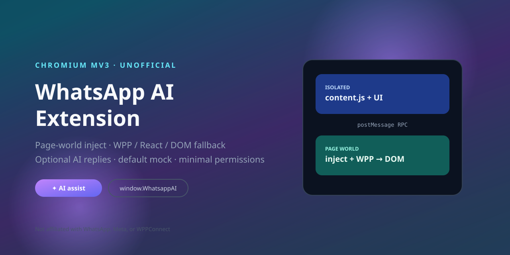
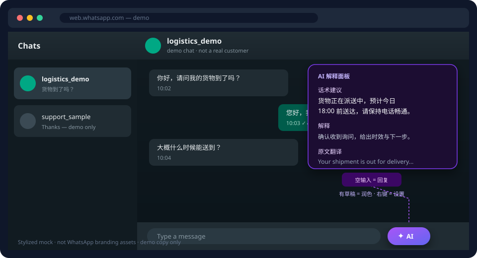
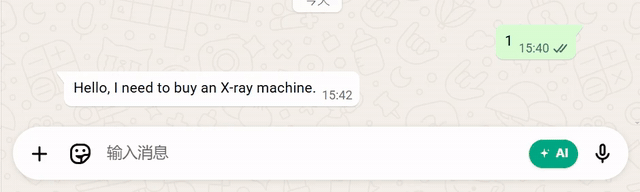
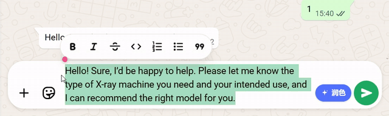
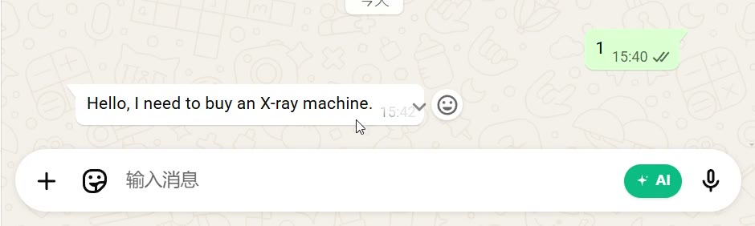
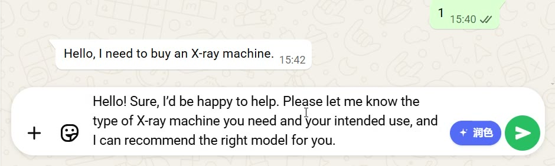

# WhatsApp AI Extension (OSS)

[中文 README](./README.md)

Unofficial **Chromium Manifest V3 browser extension** for WhatsApp Web: read the active chat, normalize messages, watch updates, fill the composer, and optionally generate AI-assisted replies.

> **Not an npm runtime SDK.** After `npm run build`, load the **repository root** (the folder that contains `manifest.json`) as an unpacked extension. The page API is exposed as `window.WhatsappAI`.

> Disclaimer: This is **not** an official WhatsApp, Meta, or WPPConnect product. You are responsible for complying with WhatsApp Terms, local law, and your organization’s policies.

[](https://github.com/daoer-bot/whatsapp-ai-sdk/actions/workflows/ci.yml)
[](LICENSE)
[](package.json)



## Why this project is interesting

| Hard problem | Approach in this repo |
| --- | --- |
| MV3 content scripts cannot see page `window` | Inject `inject.js` into the **page world**, talk over `postMessage` RPC |
| WhatsApp Web has no stable public API | **WPP → React fiber → DOM** fallback chain |
| Lexical composer easily double-inserts text | Single-write path, WPP `setTextContent` when available, verification |
| Shipping AI without leaking chats by default | Default **`mock`** provider; no bundled keys or remote endpoints |

### Architecture (SVG)


### UI mock (SVG, not official branding)



## Demo

Real walkthrough as **autoplaying GIFs** on GitHub (no download; demo chat, not a real customer).

### Generate reply (empty composer → ✦)



### Polish draft (composer has text → ✦)



| Live still: AI entry | Live still: explain panel |
| --- | --- |
|  |  |

Optional source MP4: [demo-usage.mp4](docs/assets/demo-usage.mp4). More assets: [`docs/assets/`](docs/assets/README.md).

## Features

- Read active chat + messages via `@wppconnect/wa-js`, with React/DOM fallbacks
- Subscribe to new messages in the current chat
- Fill the WhatsApp Web editor and optionally click send
- Bridge page capabilities to extension UI through isolated-world RPC
- Optional AI providers:
  - `mock` — local demo, no network (default)
  - `dify` — Dify Chat Messages API
  - `openai` — OpenAI-compatible Chat Completions (including many gateways)
  - **`outputMode`**: `text` (default, fill composer only) / `structured` (JSON + explain panel); persona prompts stay free-form, serialization contract is appended by code

- Types: [`types/whatsapp-ai-sdk.d.ts`](types/whatsapp-ai-sdk.d.ts)
- Docs: [API](docs/API.md) · [Architecture](docs/ARCHITECTURE.md) · [Compatibility](docs/COMPATIBILITY.md) · [Threat model](docs/THREAT_MODEL.md) · [Selector checklist](docs/SELECTOR_CHECKLIST.md)

## Quick start

```bash
npm ci
npm run verify
```

1. Load **repo root** at `chrome://extensions` (Developer mode → Load unpacked). **Do not** select only `dist/`.
2. Open [WhatsApp Web](https://web.whatsapp.com) and finish login.
3. Keep `mock` provider; click **✦** next to the composer (empty = reply, draft = polish).
4. **Right-click** (or long-press) **✦** for the in-page settings drawer.

```js
await window.WhatsappAI.ready();
const chat = await window.WhatsappAI.getActiveChat();
const messages = await window.WhatsappAI.getMessages(10);
await window.WhatsappAI.fillInput('Hello from WhatsappAI', true);
```

## AI / CORS notes

Requests currently run from the **content script**, so your endpoint must allow CORS from `https://web.whatsapp.com`. A Service Worker proxy is on the roadmap to reduce that friction.

API keys live in `chrome.storage.local` **unencrypted** — fine for a personal machine, not for shared browsers. See [docs/THREAT_MODEL.md](docs/THREAT_MODEL.md).

## Develop

```bash
npm ci
npm run verify   # build + secret scan + unit tests + smoke
npm audit --omit=dev
```

## Privacy & limits

- No remote URL or API key in default config
- `window.WhatsappAI` is page-visible — not an authenticated private API
- WhatsApp DOM / WPP internals can break without notice
- Full policy: [SECURITY.md](SECURITY.md)

## License

MIT — [LICENSE](LICENSE). Third-party notices: [THIRD_PARTY_NOTICES.md](THIRD_PARTY_NOTICES.md).
