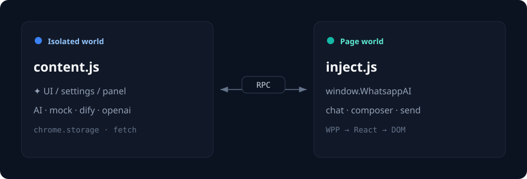

# Architecture

本文说明扩展在 WhatsApp Web 中的运行分层，以及 AI 请求路径。目标读者是想二次开发或排查注入问题的贡献者。

相关文档：[API](./API.md) · [兼容性](./COMPATIBILITY.md) · [威胁模型](./THREAT_MODEL.md) · [选择器回归清单](./SELECTOR_CHECKLIST.md)

架构示意（SVG）：



## 为什么需要 page world 注入

Chrome 扩展的 content script 运行在 **isolated world**：能访问 DOM，但**看不到**页面自己的 `window` 全局变量（例如 `window.WPP`、React fiber 内部属性）。

WhatsApp Web 的会话/消息数据主要来自页面 JS 运行时，因此本项目把“读数据”放进 **page world**，把“扩展 UI / 配置 / AI 请求”放在 isolated world，两者用 `postMessage` RPC 通信。

```text
Browser extension (project root)
├─ manifest.json
├─ options.html          → dist/options.js
└─ dist/
   ├─ content.js         content script（isolated world）
   ├─ inject.js          注入到 page world（ESM）
   ├─ bridge.js          可选调试桥
   └─ wpp.js             @wppconnect/wa-js browser bundle

WhatsApp Web tab
├─ isolated world: content.js
│    - 注入 wpp.js / inject.js
│    - 极简 ✦ 入口（左键生成 / 右键设置）
│    - 页内设置抽屉 + 解释面板（与 options.html 共享 storage）
│    - 调用 mock / dify / openai
│    - 通过 RPC 让 page world 填入/发送
│
└─ page world: inject.js + wpp.js
     - 等待 WPP ready
     - 暴露数据读取与 composer 操作
     - 降级：WPP → React fiber → DOM
```

## 数据读取降级

1. **WPP（优先）**：`@wppconnect/wa-js` 提供相对稳定的 chat/message API。  
2. **React fiber**：WPP 未就绪或失败时，尝试从 React 内部结构取当前会话消息。  
3. **DOM**：再失败则从可见 DOM 做有限解析。

composer（输入框写入、点击发送）始终依赖 DOM / Lexical 编辑器行为，不走 WPP 发送 API，以降低误发与权限面。

## RPC

`src/core/rpc.js` 封装 content ↔ inject 的请求/响应：

- 默认超时约 15 秒
- 扩展重载后旧 content script 的 `chrome.runtime` 会失效；此时需要刷新 WhatsApp 页面
- 页面导航或扩展重载后，消息监听需要重新注册

## AI 路径

```text
用户点击输入框旁 ✦（空输入=回复，有草稿=润色；右键打开设置）
  → content.js 拉取当前 chat + messages（RPC）
  → loadAiConfig()（chrome.storage.local）
  → generateReply / streamReply
       ├─ mock：本地拼演示文本
       ├─ dify：POST {baseUrl}/chat-messages
       └─ openai：POST {baseUrl}/chat/completions
  → 解析纯文本或结构化 JSON
  → RPC fillInput / 可选 send
  → 展示解释面板
```

注意：

- AI HTTP 请求当前在 **content script** 发起，受 `https://web.whatsapp.com` 的 CORS 约束。
- 默认 `provider=mock`，避免未配置时把聊天内容打到外部服务。
- API key 明文存于 `chrome.storage.local`，仅适合个人本机使用。

## 构建约定

- Rollup 产出 IIFE（content / bridge / options）与 ESM（inject）
- `wpp.js` 在 build 时从 `node_modules/@wppconnect/wa-js` 复制，避免把 WA-JS 打进 inject bundle 破坏其 webpack 劫持
- 加载扩展时选择**仓库根目录**，以便 `manifest.json` 正确引用 `dist/*`
